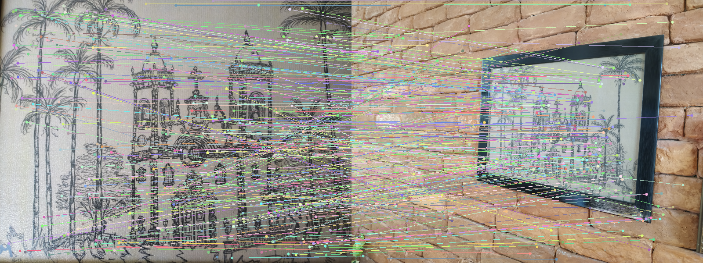
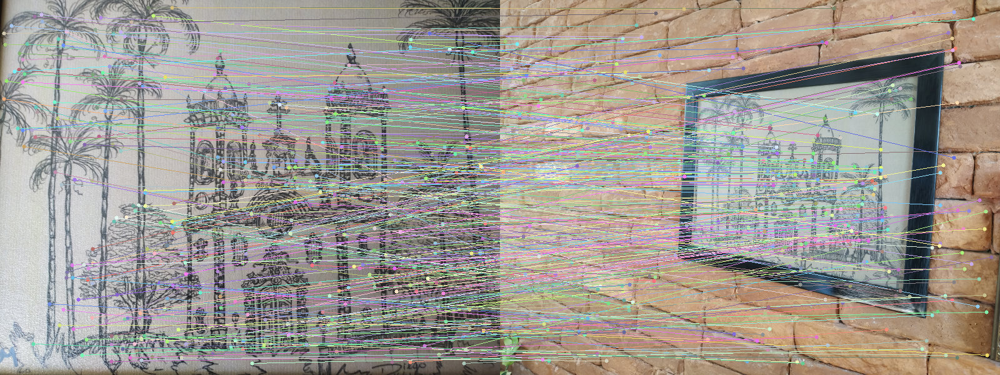
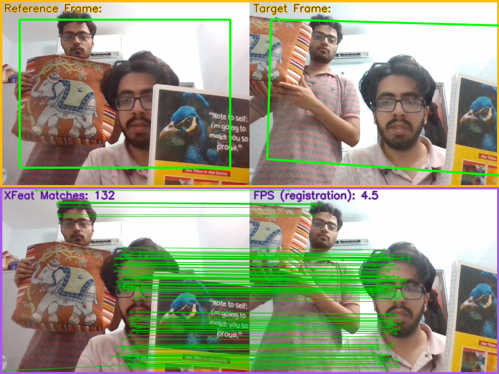

# XFeat Architectural Modifications — Group 48

> Assignment submission based on [XFeat: Accelerated Features for Lightweight Image Matching (CVPR 2024)](https://arxiv.org/abs/2404.19174)

📺 **YouTube Demo:** (https://youtu.be/__lZxUh4T-8)  


---

## Overview

This repository contains training and evaluation code for two XFeat variants trained on COCO synthetic data:

| Model | Architecture | MegaDepth AUC@10 | Params |
|---|---|---|---|
| **Baseline** | Original XFeat | 46.0 | ~277k |
| **Modified** | + InstanceNorm2d + SE Attention | 41.4 | ~279k |

---
### Match Comparison — Baseline vs Modified

*Baseline — 840 matches*

  
*Modified — 975 matches (+16%)*

---
### Modifications Made

**1. InstanceNorm2d instead of BatchNorm2d**  
Every `BasicLayer` in the backbone replaces `BatchNorm2d(affine=False)` with `InstanceNorm2d(affine=False, track_running_stats=False)`. This gives stable per-sample normalization regardless of batch size, consistent with the InstanceNorm already applied to the input image.

**2. Squeeze-and-Excitation (SE) Channel Attention**  
An SE block is inserted after the multi-scale pyramid sum `(x3 + x4 + x5)` and before `block_fusion`. It learns per-channel re-weighting via global average pooling → FC(64→16) → ReLU → FC(16→64) → Sigmoid, adding only ~2k parameters.
```python
# Modified forward pass (key change)
fused = x3 + x4 + x5        # same as original
fused = self.se_fusion(fused) # NEW: channel attention
feats = self.block_fusion(fused)
```

---


---

## Training

Both models trained on **Kaggle T4 GPU**, 30,000 steps, COCO synthetic mode.
```
Dataset:     COCO 20k images (synthetic homography warps)
Steps:       30,000
Batch size:  8
Optimizer:   Adam (lr=3e-4)
Scheduler:   StepLR (step=30k, γ=0.5)
Hardware:    Kaggle T4 GPU (~7 hours per model)
```

Open and run the notebooks on Kaggle in order:
1. `xfeat_baseline_notebook.ipynb`
2. `xfeat_modified_notebook.ipynb`

---

## Running the Live Demo
```bash
# Clone the XFeat repo
git clone https://github.com/verlab/accelerated_features.git
cd accelerated_features

# Install dependencies
pip install torch opencv-contrib-python tqdm

# Place your trained weights
cp xfeat_baseline_30000_weights.pt weights/xfeat.pt

# Run real-time demo (requires webcam)
python realtime_demo.py --method XFeat --cam 0
# Press 'S' to set reference frame, move camera to see live matches
```

---

## Results

### MegaDepth-1500 Evaluation (Standard Benchmark)

| Metric | Baseline | Modified | Paper XFeat |
|---|---|---|---|
| AUC@5° | 32.1 | 27.1 | 42.6 |
| AUC@10° | 46.0 | 41.4 | 56.4 |
| AUC@20° | 58.6 | 54.1 | 67.7 |
| mAcc@10° | 65.7% | 61.3% | — |

> Paper numbers use 160k steps on MegaDepth+COCO. Our models use 30k steps on COCO only.

### Synthetic COCO Evaluation

| Metric | Baseline | Modified |
|---|---|---|
| AUC@10px | 4.96% | 5.01% |
| Avg matches/pair | 345.7 | 366.1 |
| Avg inlier ratio | 1.4% | 1.5% |

The modified model produces more matches per pair on the synthetic eval, suggesting the SE attention improves descriptor distinctiveness locally.

---

### Real-time Webcam Demo


---
## Citation
```bibtex
@inproceedings{potje2024xfeat,
  title={XFeat: Accelerated Features for Lightweight Image Matching},
  author={Potje, Guilherme and Cadar, Felipe and Araujo, Andre and Martins, Renato and Nascimento, Erickson R},
  booktitle={CVPR},
  year={2024}
}
```
